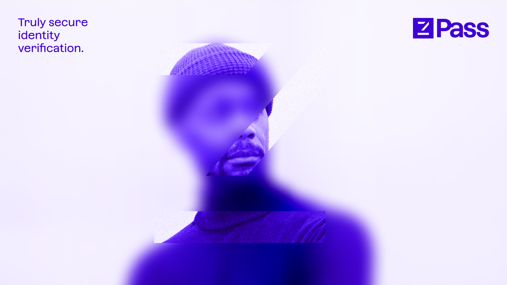

---
layout:
  title:
    visible: true
  description:
    visible: true
  tableOfContents:
    visible: true
  outline:
    visible: true
  pagination:
    visible: true
---

# Welcome to zPass

<figure><figcaption></figcaption></figure>

## Quick links


[zpass-litepaper](overview/zpass-litepaper/)



[demo.md](overview/demo.md)


## Get Started

We've put together some helpful guides for you to get setup with our product quickly and easily.


[issue-credential](fundamentals/issue-credential/)



[hash-types.md](fundamentals/issue-credential/hash-types.md)

