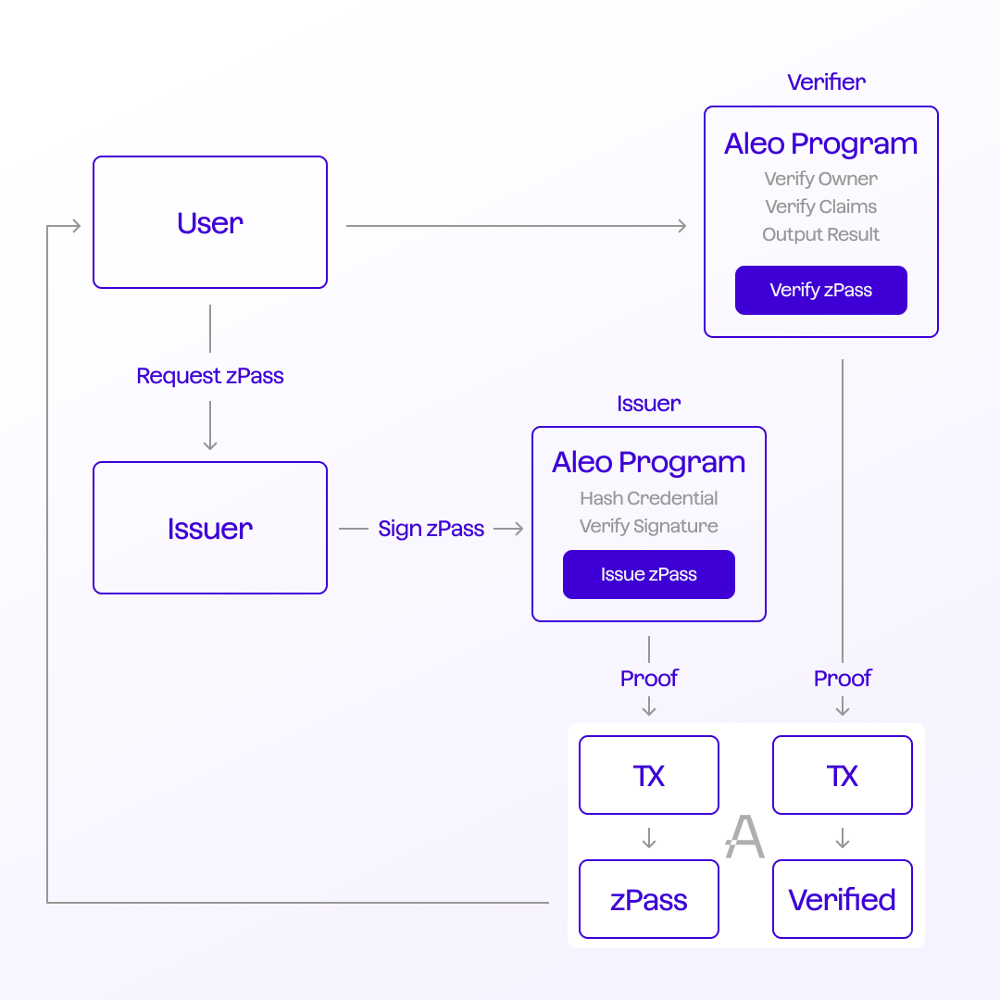

---
layout:
  title:
    visible: true
  description:
    visible: false
  tableOfContents:
    visible: true
  outline:
    visible: true
  pagination:
    visible: true
---

# On-chain flow

The on-chain flow in the Aleo ecosystem focuses on interactions directly within the blockchain. These interactions provide permissionless privacy and trust. This contrasts the off-chain flow, where operations might be initiated and completed outside the zPass system.

As mentioned in the previous section, credentials may originate from off-chain entities such as government agencies or educational institutions. Although Aleo programs do not generate these credentials, they can be integrated into the on-chain workflow.

<figure><figcaption></figcaption></figure>

### On-chain zPass Process

1. **Credential Issuance (On-chain):** Credentials are fed as inputs into Aleo programs, also known as issuance programs. These programs act as trusted authorities for generating the digital equivalents of the real-world credentials, known as zPass. The issuance process includes cryptographic validation of the credential against its digital signature and the Issuer's public key. Successful validation results in issuing a zPass committed to the Aleo blockchain. The recipient of the zPass is termed the "Holder."
2. **Holder Presentation and Verification (On-chain):** Once a zPass is issued and stored on-chain, the Holder can use it for various transactions within the Aleo ecosystem. Aleo programs verify specific claims against the presented zPass, ensuring privacy, data integrity, and establishing trust.
