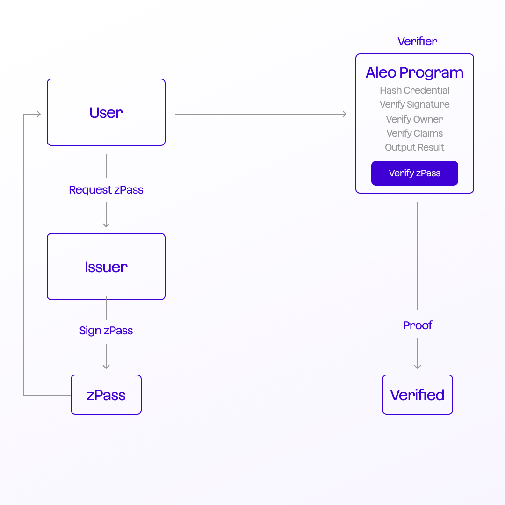

---
layout:
  title:
    visible: true
  description:
    visible: false
  tableOfContents:
    visible: true
  outline:
    visible: true
  pagination:
    visible: true
---

# Off-chain Workflow

<figure><figcaption></figcaption></figure>

## zPass **Off-Chain Flow**

The off-chain flow offers a path to ensure privacy and trust without depending on the blockchain. Let's break it down into two main sections:

* **Credential Generation (Off-chain)**
  * **User Requests a Credential**: An entity (or user) approaches a recognized issuer for a credential.
  * **Credential Generation by the Issuer**: The issuer, after due verification, creates a digital credential for the user, we refer to this as a zPass, though, this step can happen entirely outside the Aleo ecosystem.
* **Holder Presentation and Aleo Verification (Off-chain)**
  * **Credential Presentation with Aleo**: The user presents their credential (like a passport) to an Aleo program. The program doesn't record the credential details but processes it. For instance, it can hash the attributes using methods such as psd2, keccak, sha, or bhp in order to verify a signature
  * **Local Execution with WebAssembly (Wasm)**: To further the cause of privacy, zPass leverages Wasm, allowing users (holders of credentials) to run the Aleo program locally. This local execution ensures the user never reveals private inputs or trusts a third party implicitly.
  * **Program Execution and Output Generation**: Once processed, the program runs and produces an output. Crucially, this output, coupled with an execution proof, does not reveal the credential's data. Yet, it acts as a verifiable testament that the program ran with the said credentials, and the output can be trusted.
